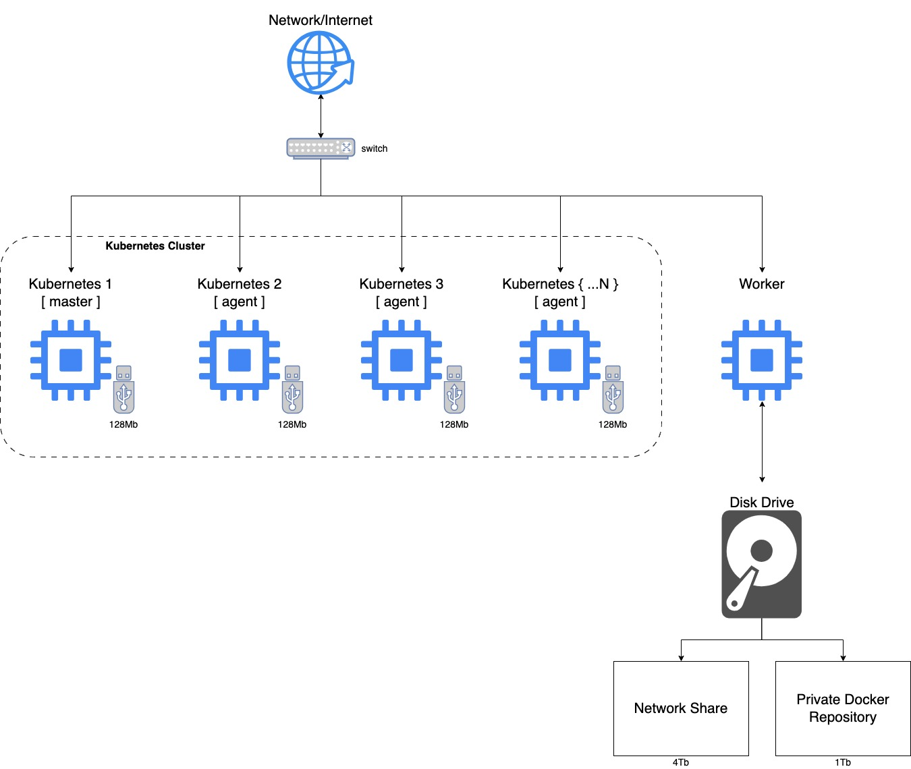

# A Kubernetes Project

These directories contain a set of Ansible Playbooks and Bash Scripts that has been designed to install and configure a [K3S Kubernetes Cluster](https://k3s.io/) on a set of [Raspberry Pis](https://www.raspberrypi.com/). However, these Ansible Playbooks and Bash Scripts should work with any hardware, or VMs, running Linux.

The following image depicts the hardware layout of the Kubernetes Cluster and it's supporting worker server. The size of the USB keys and the worker server's Disk Drive are what I used; feel free to use other sizes.

The **worker** server, hosts a samba share and a private docker repository. In these Ansible Playbooks and Bash Scripts it has the IP Address: `192.168.7.150`

Each of the Kubernetes node's IP Addresses follow with the control node's IP Address `192.168.7.151` and the subsequent worker node's being `192.168.7.152`, `192.168.7.153`, and so on.

Each Raspberry Pi is using a *Ubuntu 22.04.3 LTS* operating system.

Best practice is to burn a new OS and Update and Upgrade it before running the Playbooks.

The worker server must be setup first, then the Kubernetes Control node followed by as many Kubernetes Agent nodes as you desire.

The **k3s** folder is expected to be located on the **worker** server at the following location: `/mnt/share/k3s/`
