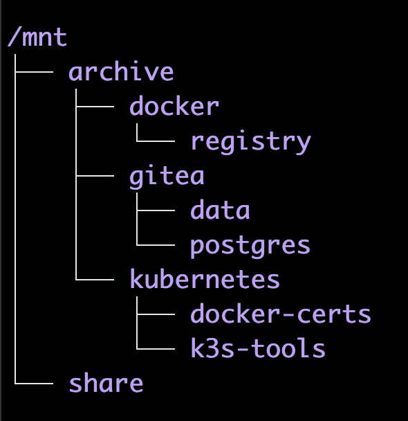
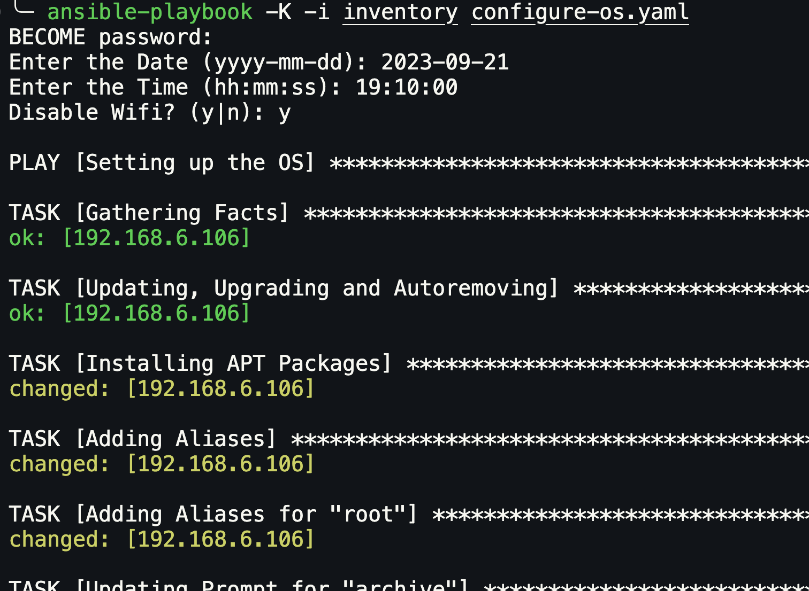
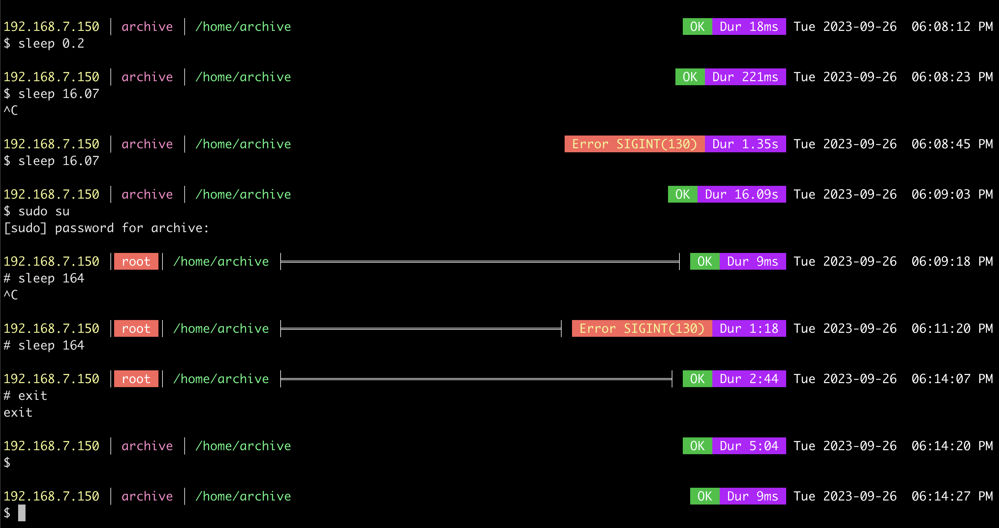

# A Kubernetes Cluster Builder Project
###### [ dodSON Software - `dodson labs` ] September 2023
This project contains a set of Ansible Playbooks and Bash Scripts that has been designed to install and configure a [K3S **Kubernetes Cluster**](https://k3s.io/) on a set of [Raspberry Pis](https://www.raspberrypi.com/) along with numerous tools. Even though this project was developed for Raspberry Pis and Ubuntu, it *should* work with any hardware, or VMs, running your favorite Linux server.

`DISCLAIMER:` I'll be the first one to admit that I do not know that much about **Linux**, **Ansible** or **Kubernetes**; however, I am learning. This project was conceived after I spent *many, many* weekends researching how to install **Kubernetes**, and *installing* **Kubernetes**. So, instead of just a bunch of notes and links, I created these Ansible Playbooks and Bash Scripts. Even with these Ansible Playbooks and Bash Scripts it takes some time to bring up a **Kubernetes Cluster**; however, it will build a **Kubernetes Cluster** correctly. I have had a lot of fun and I learned a lot doing this. I can only hope it helps others.

`CONTACT ME:` You can contact me at dodsonsoftware@gmail.com if you have any questions, comments or suggestions.

# The Current Setup
The following describes the hardware and software setup as of September 2023.

`NOTE:` It is important to understand that these Ansible Playbooks and Bash Scripts were designed to be run against/on Raspberry Pis using a Linux OS, specifically **Ubuntu 22.04.3 LTS** and are **VERY** tailored to a specific hardware setup and set of software packages. Therefore, there are commands and operations that may only work on a Raspberry Pi and/or Ubuntu.

## Overview
The **archive machine** and all of the **Kubernetes Cluster** machines are built using [Raspberry Pi 4 Model B](https://www.raspberrypi.com/products/raspberry-pi-4-model-b/specifications/) single-board computers with 4 cores ([arm v8](https://en.wikipedia.org/wiki/ARM_architecture_family)/[aarch64](https://en.wikipedia.org/wiki/AArch64)) and 8 GiBs ram. All machines have [Ubuntu Server 22.04.3 LTS](https://releases.ubuntu.com/releases/22.04/) operating systems. The operating system is written to a 64 GiB SD Card and updated and upgraded before running the scripts. The **archive machine** provides a network share and a private docker registry where the Kubernetes Cluster can pull custom container images. All of the Rapsberry Pis are connected through a gigabit network switch.

The following image shows the hardware layout of the **Kubernetes Cluster** and it's supporting **archive machine**. 

The **archive machine** has a 5 TiB Hard Disk drive, attached to the high-speed USB port, split into two partitions. The **Kubernetes Cluster** is made with 6 Raspberry Pis; each one, except the **kubernetes contoller node**, has a 128 GiB USB drive plugged into the high-speed USB ports. All of the Raspberry Pis are connected through a Gigabit Network Switch with Cat 6 cables.

6 Raspberry Pi **Kubernetes Cluster**:
- 24 Cores
- 48 GiB Ram
- 640 GiB USB Storage

The Ansible Playbooks and Bash Scripts will setup the `archive-machine`, the `kubernetes-controller-node` and any number of `kubernetes-agent-nodes`. After that, the `~/k3s-tools/install-k3s-tools.sh` on the **kubernetes contoller node**, will install a set of tools.

Once all of the scripts have been executed, the following machines will be available:
* The `archive-machine`
    * Samba Share
    * Private Docker Registry
* The `kubernetes-controller-node`
* Any number of `kubernetes-agent-nodes`

The following tools will also be installed and configured:
* [Helm](https://helm.sh/)
* [MetalLB](https://metallb.org/)
* [Longhorn](https://longhorn.io/)
* [Prometheus](https://prometheus.io/)
* [Grafana](https://grafana.com/)
* [Kubernetes Dashboard](https://kubernetes.io/docs/tasks/access-application-cluster/web-ui-dashboard/)
* [Portainer](https://www.portainer.io/)
* [ArgoCD](https://argoproj.github.io/)
* [Gitea](https://about.gitea.com/)
* [Jenkins](https://www.jenkins.io/) COMING SOON

## My Custom Grafana Dashboard
Peeking towards the end of the build process, here is a look at my custom Grafana Kubernetes Dashboard. Currently, my custom Grafana Dashboard also contains some sensor data; specifically, the temperatures from inside my house, outside my house and the pool along with some 24 hour minimums, maximums and a graph.

## The Archive Machine
The **archive machine's** primary purpose is to host a samba network share, the private docker registry and a Gitea service. The **archive machine** is using a *Ubuntu 22.04.3 LTS* operating system. Best practice is to burn a new operating system and Update and Upgrade it before running the Playbooks.

A 5 TiB HDD has been partitioned into two parts; a 4 TiB **network share** partition and a 1 TiB **archive** partition. The partitions must be created before running any Ansible Playbooks or Bash Scripts. 

The installation scripts expects these partitions to already exist; the reasoning is, that we could be re-building the **archive machine** and already have directories and files stored on the network **share** partition and the **archive** partition may already have images uploaded to it and we do not want to erase these things. The scripts will also check for the certificates and only create them if they don't exist.

The scripts will take care of adding these partitions to the **/etc/fstab** file for you so they will automatically be mounted on boot up. These partitions will be mounted and accessible under the **/mnt** directory as `/mnt/share` and `/mnt/archive`.

The **archive machine** must be setup first, then the Kubernetes Control node followed by as many Kubernetes Agent nodes as you desire.

### The /mnt Directory

The `/mnt` directory contains the `/archive` and the network `/share` partitions.

The `/mnt/archive` folder contains the **private docker registry's images**, the **Gitea data**, the **Gitea Postgres database** and the **kubernetes folder** which contains the self-signed certificates used to access the **private docker registry**, the **Kubernetes Cluster Agent Connection Token** and the **kubernetes k3s-tools** folder.

The network `/share` directory is where the **samba network share** is accessed.

In the Ansible Playbooks and Bash Scripts the **archive machine** has the IP Address: `192.168.7.150`

* 192.168.7.150 : Archive Machine

## The Kubernetes Cluster
Every node in the **Kubernetes Cluster**, except for the **kubernetes contoller node**, has a 128 GiB USB drive which will be used by **Longhorn** for persistent storage.

In the Ansible Playbooks and Bash Scripts the **Kubernetes Cluster** IP Addresses start with `192.168.7.151` for the **kubernetes contoller node** with the subsequent cluster node's being `192.168.7.152`, `192.168.7.153`, and so on.

* 192.168.7.151 : Kubernetes Control Node
* 192.168.7.152 : Kubernetes Agent Node
* 192.168.7.153 : Kubernetes Agent Node
* 192.168.7.154 : Kubernetes Agent Node
* 192.168.7.155 : Kubernetes Agent Node
* 192.168.7.156 : Kubernetes Agent Node

The **k3s-tools** folder is expected to be located on the **archive machine** at the following location: `/mnt/archive/kubernetes/k3s-tools/`

# Running the Scripts

## Overview
Each Raspberry Pi uses a **Ubuntu 22.04.3 LTS** operating system; you should boot up each machine, log in and update and upgrade them before doing anything else.

First, build the **archive machine** by running the Ansible Playbook, then log into the **archive machine** and run the `~/run-me-first-as-sudo.sh` script.

Next, build the **kubernetes controller node** by running the Ansible Playbook, then log into the **kubernetes controller node** and run the `~/run-me-first-as-sudo.sh` script; however, do not run the `~/k3s-tools/install-k3s-tools.sh` yet, that should be executed last after all of the **kubernetes agent nodes** have been added.

Next, build each of the **kubernetes agent nodes** by running the Ansible Playbook, then log into each **kubernetes agent node** and run the `~/run-me-first-as-sudo.sh` script.

Finally, return to the **kubernetes contoller node** and run the `~/k3s-tools/install-k3s-tools.sh` script to complete the build and install the kubernetes tools.

`NOTE:` You should log into the actual machine to run the `~/run-me-first-as-sudo.sh` script because it will change the IP Address of the machine and if you are logged in remotely, you *will* lose the connection in the middle of the script's execution; the `~/k3s-tools/install-k3s-tools.sh` can be run remotely.

`IMPORTANT:` You must open and edit the `inventory`, `configure-os.yaml` and `run-me-first-as-sudo.sh` files and replace, using a text search-and-replace function, the username, *everytime*, before running the Ansible Playbooks. If you fail to change the username, then the Ansible Playbooks and/or the `run-me-first-as-sudo.sh` files may fail.

### Running the Ansible Playbook

## Common Script Functionality
All of the scripts will setup the operating systems in a similar fashion; there is a common set of APT packages installed, a common set of aliases, common command line prompts, VIM is configured the same and the date and time are configured to update automatically.

### Command Line Prompts

The standard user gets a command line prompt with the IP Address, the user name and the current working path on the left side. And the last command's exit code, the duration of the last command and the current date and time on the right side. The cursor is below the command line prompt; the standard user will get a dollar sigh ( $ ) and the root user will get a pound sign ( # ).

The root user gets the same command line prompt, except for a line across the middle and the user name is inverted with white on red text. This helps to differentiate the standard user from the root user.

If there is less than 80 columns on the screen, then the date and time will not be displayed.

### Aliases
There are a set of common aliases for all operating system setups:
* bat
    * This is short for [batcat](https://github.com/sharkdp/bat)
* filesys
    * Display some file system information
* dockersys
    * Displays the images and containers in docker
* dockerremote
    * Displays the images in the remote private docker registry
* tools
    * Displays a set of installed tools and aliases
* h
    * Short for `history`
* hg
    * Short for `history | grep `
* l, ll, lll
    * Lists folders and files
* llll
    * Clears the screen and runs [neofetch](https://github.com/dylanaraps/neofetch)
* matrix
    * Runs [cmatrix](https://github.com/matriex/cmatrix) with some choice command line arguments
* py
    * Short for `python3`
* pip
    * Short for `pip3`
* update
    * Will perform an `apt update`, `apt upgrade` and an `apt autoremove`

The **kubernetes controller** machine includes a few aliases not available on the other systems:
* kubesys
    * Displays all the **Nodes** and all the **Pods**
* kubetoken
    * Displays the Kubernetes Server Connection Token, required to install **Agents**
* kubedashboardtoken
    * Displays the **Kubernetes Dashbord** Login Token

### VIM

[VIM](https://en.wikipedia.org/wiki/Vim_(text_editor)) has been tweaked, yet it is a *constant* work-in-progress. :smiley:

### Date and Time
The date and time are configured to automatically check for the correct time using the following settings in the `/etc/systemd/timesyncd.conf` file:

`NTP=0.us.pool.ntp.org`

`FallbackNTP=1.us.pool.ntp.org 2.us.pool.ntp.org 3.us.pool.ntp.org`

## The Archive Machine
First, the **archive machine** needs to be setup. Change the directory to `archive-server` and edit the `configure-os.yaml` file. You may want to use a text search-and-replace function to replace the server's username from `archive` to whatever you wish. 

The `inventory` file will need to be edited to add the server's current IP Address and the SSH username and password. And the `./setup-files/run-me-first-as-sudo.sh` file may need to be edited to change the samba username, mount path and the private docker registry path. 

Finally, run the following command:

`
ansible-playbook -K -i inventory configure-os.yaml
`

This will start Ansible and play the `configure-os.yaml` playbook. First, it will ask for the SSH password to access the **archive machine**; then it will ask for the current date and time and whether to disable the Wifi interface. The playbook will then perform the following actions:
* Performs an Update/Upgrade
* Installs a set of applications using the [APT Package Manager](https://linuxize.com/post/how-to-use-apt-command/)
* Adds aliases for the user and the root user
* Creates command line prompts for the user and the root user
* Disables the Bluetooth interface
* Disables the Wifi interface, if you answered `y` to the question above
* Creates the `/mnt/share` and the `/mnt/archive` folders
* Mounts the, already existing, partitions and add them to the `/etc/fstab` file
* Creates a remote directory and copy the setup files into it
* Copies the `k3s-setup` directory to the `/mnt/share/.kubernetes` directory
* Sets the current date and time, with the values provided earlier
* Updates the `/etc/systemd/timesyncd.conf` file to get time-sync information
* Sets `timedatectl` to automatically update the date and time
* Copies the `run-me-first-as-sudo.sh` and `01-netcfg.yaml` files to the user's root directory
* Copies the `gitea` folder to the user's root directory
* Installs Docker
* Configures [VIM](https://en.wikipedia.org/wiki/Vim_(text_editor))
* Deletes the remote directory
* Performs another Update/Upgrade
* Reboots

Once the **archvie machine** has rebooted, log into it and run the `run-me-first-as-sudo.sh` script. This file requires that it is run as sudo and that you provide an IP Address with a mask. Because the provided IP Address will become the machine's static IP Address, it would be best to log into the actual machine and run this script locally; if you run the script remotely, you will lose connection as soon as it changes the IP Address. 

Example:

`
sudo run-me-first-as-sudo.sh 192.168.7.150/22
`

This script will perform the following actions:
* Creates the following directories, if they don't already exist:
    * `/mnt/archive/kubernetes`
    * `/mnt/archive/kubernetes/docker-certs`
    * `/mnt/archive/kubernetes/docker-certs/public`
* Creates self-signed certificates to access the private docker registry, if they don't already exist
* Copies the certificates to various places in the operating system
* Copies the certificates to the `/mnt/archive/kubernetes/docker-certs` directory
* Creates a `ca.crt` in the `/mnt/archive/kubernetes/docker-certs/public` directory
* Restarts Docker, to apply the certificates
* Pulls and starts the private docker registry
* Sets up the static IP Address, supplied as an argument to the script
* Gets the IP Address, for verification that it was applied correctly
* Installs the samba share
* Creates a `git` user
* Creates required folder in the `/mnt/archive` folder
* Installs `Gitea`
* Checks the private docker repository by retrieving it's catalog
* Asks if you would like to delete this script file
* Asks if you would like to reboot

## The Kubernetes Controller Node
Next, the **Kubernetes Controller Node** needs to be setup. Change the directory to `k3s-controller` and edit the `configure-os.yaml` file. You may want to use a text search-and-replace function to replace the server's username from `kube1` to whatever you wish. 

The `inventory` file will need to be edited to add the server's current IP Address and the SSH username and password. And the `./setup-files/run-me-first-as-sudo.sh` file may need to be edited to change the server's username, private docker registry's IP Address and the share's IP Address and username. 

Finally, run the following command:

`
ansible-playbook -K -i inventory configure-os.yaml
`

This will start Ansible and play the `configure-os.yaml` playbook. First, it will ask for the SSH password to access the **kubernetes contoller node**; then it will ask for the current date and time and whether to disable the Wifi interface. The playbook will then perform the following actions:
* Performs an Update/Upgrade
* Installs a set of applications using the [APT Package Manager](https://linuxize.com/post/how-to-use-apt-command/)
* Adds aliases for the user and the root user
* Creates command line prompts for the user and the root user
* Disables the Bluetooth interface
* Disables the Wifi interface, if you answered `y` to the question above
* Creates a remote directory and copy the setup files into it
* Sets the current date and time, with the values provided earlier
* Updates the `/etc/systemd/timesyncd.conf` file to get time-sync information
* Sets `timedatectl` to automatically update the date and time
* Configures [VIM](https://en.wikipedia.org/wiki/Vim_(text_editor))
* Copies the `run-me-first-as-sudo.sh` and `01-netcfg.yaml` files to the user's root directory
* Prepares the operating system for Kubernetes
    * Enables some `cgroup` items
    * Adds the `KUBECONFIG` environment variable
* Installs Docker
* Deletes the remote directory
* Performs another Update/Upgrade
* Reboots

Once the **kubernetes contoller node** has rebooted, log into it and run the `run-me-first-as-sudo.sh` script. This file requires that it is run as sudo and that you provide an IP Address with a mask. Because the provided IP Address will become the machine's static IP Address, it would be best to log into the actual machine and run this script locally; if you run the script remotely, you will lose the connection as soon as it changes the IP Address. 

Example:

`
sudo run-me-first-as-sudo.sh 192.168.7.151/22
`

This script will perform the following actions:
* Copies the self-signed certificates from the `archive` machine
* Adds the certificates to docker
* Restarts docker, to apply the certificates
* Sets up the static IP Address, supplied as an argument to the script
* Gets the IP Address, for verification that it was applied correctly
* Installs Kubernetes as a Controller Node
`archive` machine
* Copies the Kubernetes Controller Token to the share directory
* Installs [k9s](https://k9scli.io/), a terminal based UI to interact with your Kubernetes cluster
* Checks the private docker repository by retrieving it's catalog
* Copies the `k3s-setup` directory from the archive machine's `/mnt/archive/kubernetes/` directory to the user's root directory
* Asks if you would like to delete this script file
* Asks if you would like to reboot

`NOTE:` The `~/k3s-tools/install-k3s-tools.sh` should be executed after installing all of the **agent nodes**.

## The Kubernetes Agent Nodes
Finally, setup the **Kubernetes Agent Nodes**. Change the directory to `k3s-agents` and edit the `configure-os.yaml` file. You will want to use a text search-and-replace function to replace the server's username from `kube2` to the username of the **Kubernetes Agent Node** you're installing. 

The `inventory` file will need to be edited to add the server's current IP Address and the SSH username and password. And the `./setup-files/run-me-first-as-sudo.sh` file will need to be edited to change the server's username, private docker registry's IP Address, the Kubernetes Controller IP Address and the share's IP Address and username. 

Finally, run the following command:

`
ansible-playbook -K -i inventory configure-os.yaml
`

This will start Ansible and play the `configure-os.yaml` playbook. First, it will ask for the SSH password to access the **kubernetes agent node**; then it will ask for the current date and time and whether to disable the Wifi interface. The playbook will then perform the following actions:
* Performs an Update/Upgrade
* Installs a set of applications using the [APT Package Manager](https://linuxize.com/post/how-to-use-apt-command/)
* Adds aliases for the user and the root user
* Creates command line prompts for the user and the root user
* Disables the Bluetooth interface
* Disables the Wifi interface, if you answered `y` to the question above
* Wipes and formats the USB drives
* Creates the `/mnt/storage01` directory and mount the USB Drive to it
* Adds the mount information to the `etc/fstab` file
* Creates a remote directory and copy the setup files into it
* Sets the current date and time, with the values provided earlier
* Updates the `/etc/systemd/timesyncd.conf` file to get time-sync information
* Sets `timedatectl` to automatically update the date and time
* Configures [VIM](https://en.wikipedia.org/wiki/Vim_(text_editor))
* Copies the `run-me-first-as-sudo.sh` and `01-netcfg.yaml` files to the user's root directory
* Prepares the operating system for Kubernetes
    * Enables some `cgroup` items
    * Adds the `KUBECONFIG` environment variable
* Installs Docker
* Deletes the remote directory
* Performs another Update/Upgrade
* Reboots

Once the **kubernetes agent node** has rebooted, log into it and run the `run-me-first-as-sudo.sh` script. This file requires that it is run as sudo and that you provide an IP Address with a mask. Because the provided IP Address will become the machine's static IP Address, it would be best to log into the actual machine and run this script locally; if you run the script remotely, you will lose the connection as soon as it changes the IP Address. 

Example:

`
sudo run-me-first-as-sudo.sh 192.168.7.152/22
`

This script will perform the following actions:
* Copies the self-signed certificates from the `archive` machine
* Adds the certificates to docker
* Restarts docker, to apply the certificates
* Sets up the static IP Address, supplied as an argument to the script
* Gets the IP Address, for verification that it was applied correctly
* Gets the Kubernetes Controller Token from the share directory
* Installs Kubernetes as an Agent Node
* Adds the `KUBECONFIG` environment variable
* Checks the private docker repository by retrieving it's catalog
* Asks if you would like to delete this script file
* Asks if you would like to reboot

Run this Ansible Playbook for each Kubernetes Agent Node you wish to add to the Kubernetes Cluster.

## Installing the Kubernetes Cluster Tools

After all of the **Kubernetes Agent Nodes** have been installed, return to the **Kubernetes Controller Node** and run the `~/k3s-tools/install-k3s-tools.sh` file.

`IMPORTANT:` When running the `~/k3s-tools/install-k3s-tools.sh`, there will be times when it is showing the state of the Kubernetes Cluster using the linux `watch` command. In order to continue, you must press `ctrl+c`; be careful to only press `ctrl+c` once, otherwise you might terminate any following actions. 

Running the `~/k3s-tools/install-k3s-tools.sh` file will perform the following actions and completes the Kubernetes Cluster Build:
* Sets `worker` labels for all **Kubernetes Agent Nodes**
    * `kubernetes.io/role=worker`
    * `node-type=worker`
* Installs [Helm](https://helm.sh/)
* Installs [MetalLB](https://metallb.org/)
* Installs [Longhorn](https://longhorn.io/)
* Installs [Portainer](https://www.portainer.io/)
* Installs [ArgoCD](https://argoproj.github.io/)
* Installs [Kubernetes Dashboard](https://kubernetes.io/docs/tasks/access-application-cluster/web-ui-dashboard/)
* Installs [Prometheus](https://prometheus.io/)
* Installs [Grafana](https://grafana.com/)

Once all of the tools have been installed, you can delete the `~/k3s-tools` directory.

`NOTE:` Have patience when installing these tools; it could take a very, very long time for some of them to completely install.

# Kubernetes Tools's Ingresses
Many of the **Kubernetes Tools** have web-based user-interfaces; these are exposed using *ingress* files. **MetalLB** provides a set of IP Addresses, called an *IPAddressPool*, which can be exposed through an **ingress**.

To change the *IPAddressPool* goto the `k3s-tools/metallb` folder and edit the `metallb-ipaddresspool.yaml` file.

The following is a list of tools with the filenames and line numbers where the IP Addresses are defined. Next to each name is the default IP Address used in the scripts.

* MetalLB `[ 192.168.7.200-192.168.7.250 ]`
    * **metallb-ipaddresspool.yaml**: Line 8

* Kubernetes Dashboard `[ 192.168.7.210 ]`
    * **install-kubernetes-dashboard.sh**: Line 20
    * **kubernetes-dashboard.yaml**: Line 42

* Longhorn `[ 192.168.7.212 ]`
    * **install-longhorn.sh**: Line 35
    * **longhorn-ingress.yaml**: Line 10

* Prometheus `[ 192.168.7.214 ]`
    * **install-prometheus.sh**: Line 53
    * **prometheus.yaml**: Line 55

* Portainer `[ 192.168.7.216 ]`
    * **install-portainer.sh**: Line 32
    * **portainer-ingress.yaml**: Line 16

* ArgoCD `[ 192.168.7.218 ]`
    * **install-argocd.sh**: Line 15 and Line 30

* Grafana `[ 192.168.7.220 ]`
    * **install-grafana.sh**: Line 18
    * **grafana.yaml**: Line 88

# IP Addresses Everywhere
There are a lot of locations where IP Address have snuck into these documents; aliases, scripts and yaml files contain IP Addresses here and there. Some are cosmetic, others are functional. The following list contains all the files and line numbers where IP Address exist. (I did not include any readme files):

Folder: `archive-server`
* File: `configure-os.yaml`
    * Line 89
    * Line 114
* File: `inventory`
    * Line 1

Folder: `archive-server/setup-files`
* File: `01-netcfg.yaml`
    * Line 12
* File: `run-me-first-as-sudo.sh`
    * Line 7
    * Line 13
    * Line 20
    * Line 80
    * Line 82 [ This is not an IP Address, but the information for creating a self-signed certificate ]
    * Line 88
    * Line 89

Folder: `k3s-agents`
* File: `configure-os.yaml`
    * Line 94
    * Line 119
* File: `inventory`
    * Line 1

Folder: `k3s-agents/setup-files`
* File: `01-netcfg.yaml`
    * Line 12
* File: `run-me-first-as-sudo.sh`
    * Line 7
    * Line 13
    * Line 20
    * Line 26
    * Line 27
    * Line 28
    * Line 135

Folder: `k3s-controller`
* File: `configure-os.yaml`
    * Line 93
    * Line 121
* File: `inventory`
    * Line 1

Folder: `k3s-controller/setup-files`
* File: `01-netcfg.yaml`
    * Line 12
* File: `run-me-first-as-sudo.sh`
    * Line 7
    * Line 13
    * Line 20
    * Line 26
    * Line 27
    * Line 146

Folder: `k3s-tools/argocd`
* File: `install-argocd.sh`
    * Line 15
    * Line 30

Folder: `k3s-tools/grafana`
* File: `install-grafana.sh`
    * Line 18
* File: `grafana.yaml`
    * Line 88

Folder: `k3s-tools/k8s-dashboard`
* File: `install-kubernetes-dashboard.sh`
    * Line 20
* File: `kubernetes-dashboard.yaml`
    * Line 42

Folder: `k3s-tools/longhorn`
* File: `install-longhorn.sh`
    * Line 35
* File: `longhorn-ingress.yaml`
    * Line 10

Folder: `k3s-tools/metallb`
* File: `metallb-ipaddresspool.yaml`
    * Line 8

Folder: `k3s-tools/portainer`
* File: `install-portainer.sh`
    * Line 32
* File: `portainer-ingress.yaml`
    * Line 16

Folder: `k3s-tools/prometheus`
* File: `install-prometheus.sh`
    * Line 52
* File: `prometheus.yaml`
    * Line 55
